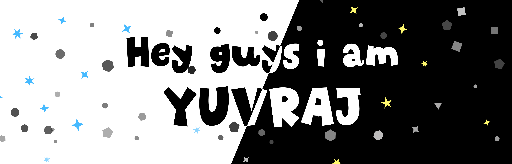

<!--<h1 align="center">Code enthusiast crafting digital dreams ✨</h1>-->
<h1 align="center">
    
</h1>

<h2>About me 💫 </h2>

    
- 🎨 UI/UX Enthusiast: Designs with flair!
- 📚 Always Learning, Creating: Evolving daily.
- 💡 Love bringing my Ideas to Life!
- 🌐 Realm Roamer: Venturing into diverse domains!
- 🌱 Growth Junkie: Lifelong learner.
- 🎮 Gaming, Fitness Fun: Sweet life!
- 😄 Joyful Living: Fun Ambassador!

 

 
 
 
  &nbsp;&nbsp;&nbsp;
  &nbsp;&nbsp;&nbsp;
  

<h1 align="center">⚒️ Languages-Frameworks-Tools ⚒️</h1>
 

    
     

 

